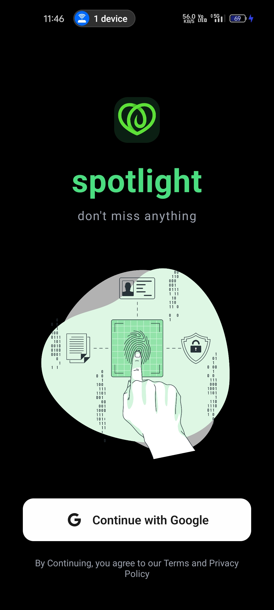

# Welcome to your Expo app 👋

This is an Expo project designed to demonstrate building and running a mobile app with React Native and Expo. It supports both Android and iOS platforms.

## Get started (locally)

1. **Clone the Prject from Github**

   ```sh
   git clone https://github.com/hacanand/spotlight.git
   cd spotlight
   ```

2. **Install dependencies**
- we are using bun as a package manager for faster installation
  but you can use npm or yarn as well if bun is not installed in your system.Then you can run all command with npm or yarn as well or you can install bun by running below command
   ```sh
   npm install -g bun
   ```
   then you can run below command to install all dependencies
   ```sh
   bun install  
   ```
   or you can run below command to install all dependencies with npm
   ```sh
   npm install
   ```
3. **Start the app**
- you can run below command to start the app
   ```sh
   bun expo start
   ```
   or you can run below command to start the app with npm
   ```sh 
   npm expo start
   ```
4. **Open the app on your phone**
   - Download the Expo Go app from the [App Store](https://apps.apple.com/app/apple-store/id982107779) or [Google Play](https://play.google.com/store/apps/details?id=host.exp.exponent) on your phone
   - Use the camera to scan the QR code that appears in the terminal.
   - You can also use an Android or iOS simulator to run the app on your computer.
   - In the output, you'll find options to open the app in a 
       - [development build](https://docs.expo.dev/develop/development-builds/introduction/)
       - [Android emulator](https://docs.expo.dev/workflow/android-studio-emulator/)
       - [iOS simulator](https://docs.expo.dev/workflow/ios-simulator/)
       - [Expo Go](https://expo.dev/go), a limited sandbox for trying out app development with Expo

## Features
- [x] User can Sign Up using google oauth
- [x] User can Post the images with caption
- [x] User can see the images posted by other users
- [x] User can like the images
- [x] User can comment on the images
- [x] User can see the comments on the images
- [x] User can see the likes on the images
- [x] User can see the profile of other users
- [x] User can follow the other users
- [x] User can see the followers and following of other users
- [x] User can see update the profile
- [x] User can see the nofications
- [x] User can bookmark the images
- [x] User can see the bookmarked images
- [x] User can see the images of the users they are following

## Screenshots(Updated)



 

## Tech Stack
- [React Native](https://reactnative.dev/)
- [Expo](https://expo.dev/)
- [Convex](https://www.convex.dev/)
- [TypeScript](https://www.typescriptlang.org/)

## Contributing
Contributions are what make the open-source community such an amazing place to learn, inspire, and create. Any contributions you make are **greatly appreciated**.

1. Fork the Project
2. Create your Feature Branch (`git checkout -b feature/AmazingFeature`)
3. Commit your Changes (`git commit -m 'Add some AmazingFeature'`)
4. Push to the Branch (`git push origin feature/AmazingFeature`)
5. Open a Pull Request

## License
Distributed under the MIT License. See `LICENSE` for more information.
